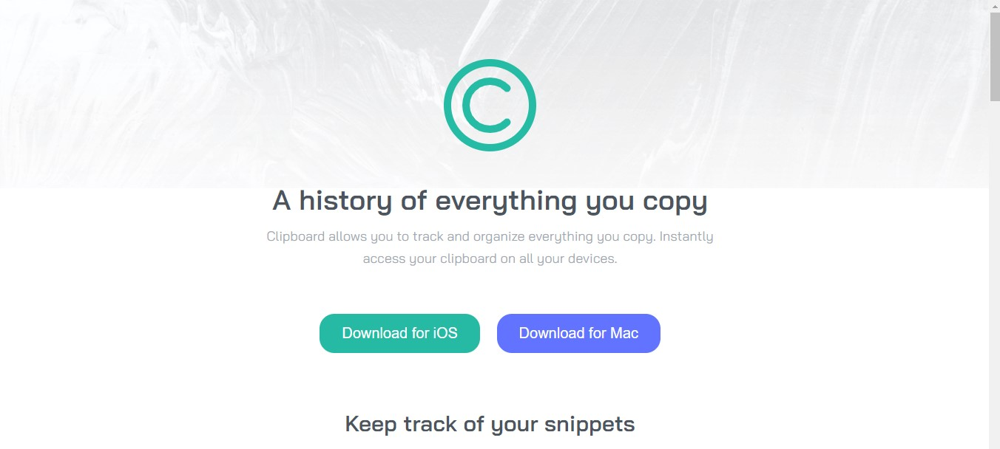

## Table of contents

- [Overview](#overview)
  - [Screenshot](#screenshot)
  - [Links](#links)
- [My process](#my-process)
  - [Built with](#built-with)
  - [What I learned](#what-i-learned)
- [Author](#author)
- [Acknowledgments](#acknowledgments)

## Overview

This is a solution to the [Clipboard landing page challenge on Frontend Mentor](https://www.frontendmentor.io/challenges/3column-preview-card-component-pH92eAR2-). This project was assigned by [web3bridge](https://www.web3bridge.com/) for Web2 cohort VII.

### Screenshot

### Links

- Live Site URL: (https://lynda-obiz.github.io/clipboard-landing-page/)

## My process

### Built with

- Semantic HTML5 markup
- CSS custom properties
- Flexbox
- Grid
- Media Query

### What I learned

While working on this project to be fully responsive gave me more imsight on media querry's for various devices.

## Author

- Twitter - [LyndaObiz](https://www.twitter.com/LyndaObiz)

## Acknowledgments

Thanks to my tutor  [Adetutu Gbangbola](https://github.com/Adetutu777)  and  [Web3Bridge](https://www.web3bridge.com) community for this opportunity. 